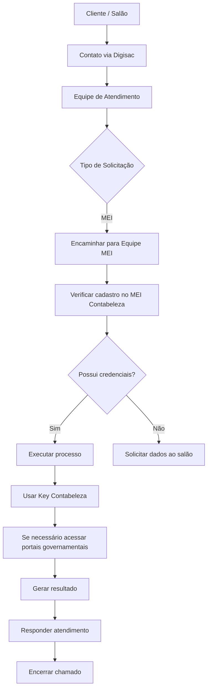
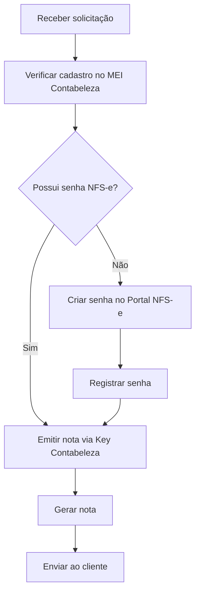
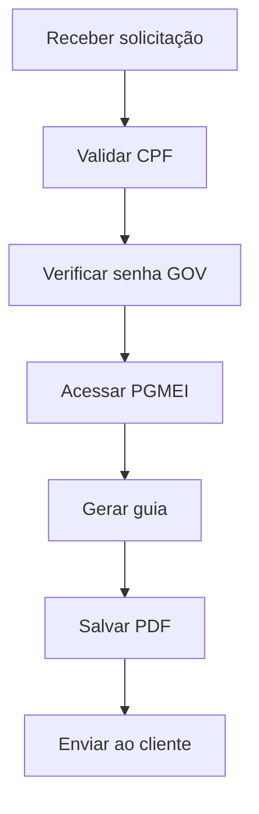
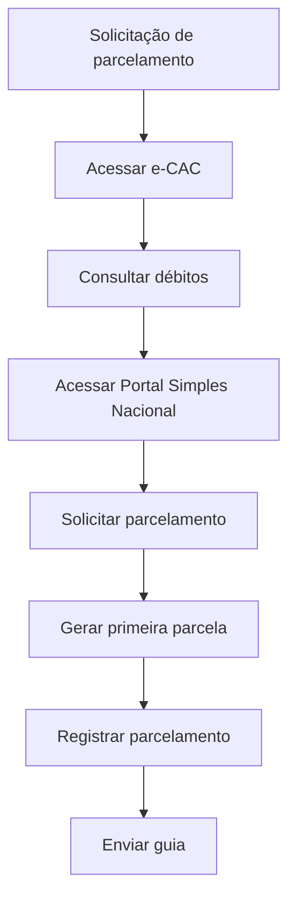
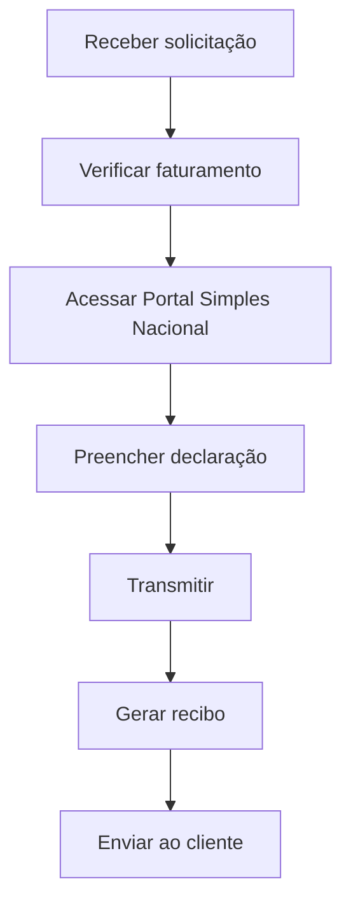
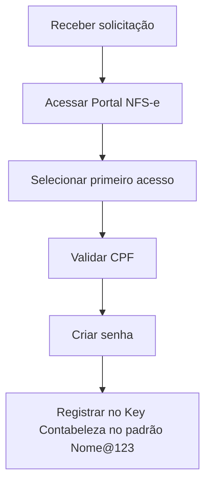
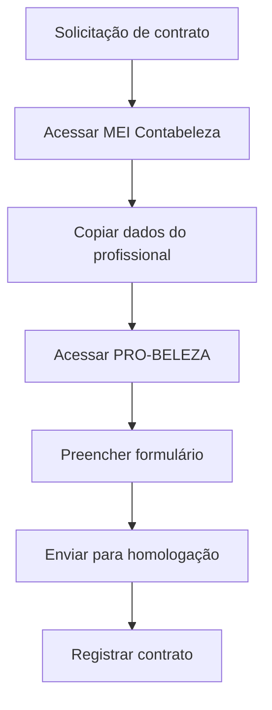
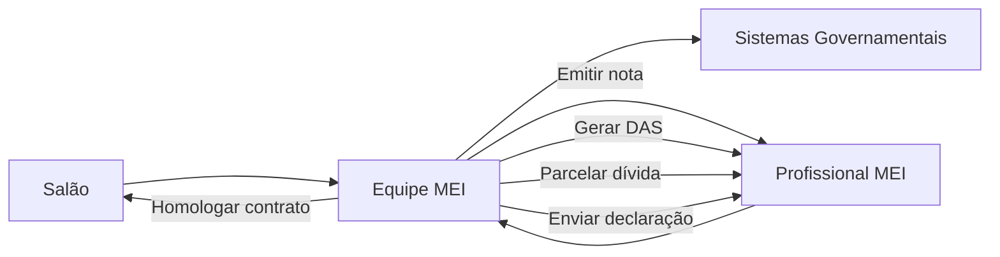

# 💇‍♀️ Processos Operacionais Repetitivos — Setor MEI

> Documento técnico que descreve **todos os processos operacionais repetitivos do setor MEI da Contabeleza**, incluindo fluxos operacionais, diagramas e casos de uso.

Este documento foi projetado para ser **visual, técnico e fácil de navegar**, servindo como base para **descoberta de automações**.

---

# 🎯 Objetivo

Mapear de forma clara:

* processos repetitivos
* sistemas envolvidos
* variáveis utilizadas
* pontos de decisão
* possíveis gargalos

Isso permite:

* identificação de automações
* padronização de procedimentos
* entendimento rápido do fluxo operacional

---

# 🧩 Sistemas Envolvidos

Os processos do setor MEI envolvem os seguintes sistemas:

```
Cliente / Salão
      ↓
Digisac (Atendimento)
      ↓
Equipe MEI
      ↓
MEI Contabeleza
      ↓
Key Contabeleza
      ↓
Sistemas Governamentais

    • e-CAC
    • PGMEI
    • Portal Simples Nacional
    • Portal NFS-e
    • Meu Imposto de Renda

Plataformas externas

    • PRO-BELEZA
```

---

# 🔄 FLUXO GERAL DE SOLICITAÇÕES



---

# 📄 PROCESSO 1 — EMISSÃO DE NOTA DO PROFISSIONAL (MEI → SALÃO)

## Descrição

Profissionais parceiros precisam emitir nota contra o salão mensalmente.

A equipe MEI executa esse processo quando:

* o salão não emitiu
* o profissional solicita
* há necessidade de regularização

---

## Fluxo



---

# 📄 PROCESSO 2 — EMISSÃO DE GUIA DAS MEI

## Descrição

Processo recorrente para pagamento mensal do MEI.

---



---

# 📄 PROCESSO 3 — PARCELAMENTO DE DÍVIDA MEI

## Descrição

Executado quando o profissional possui débitos em aberto.

---



---

# 📄 PROCESSO 4 — ENTREGA DA DECLARAÇÃO DASN-SIMEI

## Descrição

Declaração anual obrigatória para MEIs.

---



---

# 📄 PROCESSO 5 — CRIAÇÃO DE SENHA NFS-e

## Descrição

Necessário para permitir emissão de notas.

---



---

# 📄 PROCESSO 6 — HOMOLOGAÇÃO DE CONTRATO SALÃO PARCEIRO

## Descrição

Contrato entre salão e profissional precisa ser homologado.

---



---

# 👥 DIAGRAMA DE CASO DE USO



---

# ⚠️ Principais Gargalos Operacionais

Processos repetitivos identificados:

```
Coleta de credenciais GOV
Criação de senha NFS-e
Acesso manual a portais
Copiar e colar dados entre sistemas
Consulta de dados fiscais
```

---

# 🤖 Potencial de Automação

Alta prioridade para automação:

```
Emissão de notas MEI
Geração de DAS
Consulta de débitos
Parcelamento automático
Coleta e armazenamento de credenciais
```

---

# 📊 Impacto Esperado com Automação

Benefícios:

```
Redução de trabalho manual
Menos erros humanos
Execução mais rápida
Escalabilidade operacional
```

---

# 🧠 Conclusão

O setor MEI possui **diversos processos altamente repetitivos**, com forte dependência de:

* autenticação
* consulta de dados
* navegação em portais

Isso torna o setor **altamente adequado para automações baseadas em APIs, workflows e RPA**.

Este documento serve como base para:

* discovery de automações
* arquitetura de soluções
* planejamento técnico
* implementação futura.
