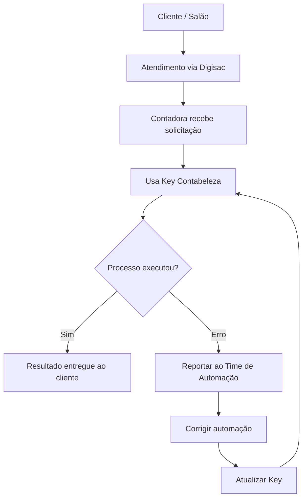
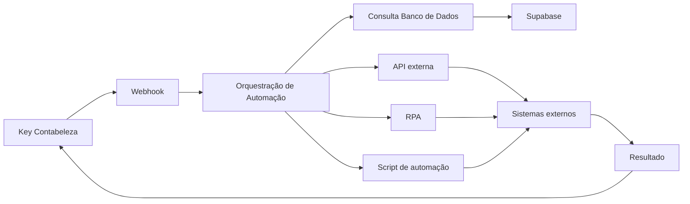
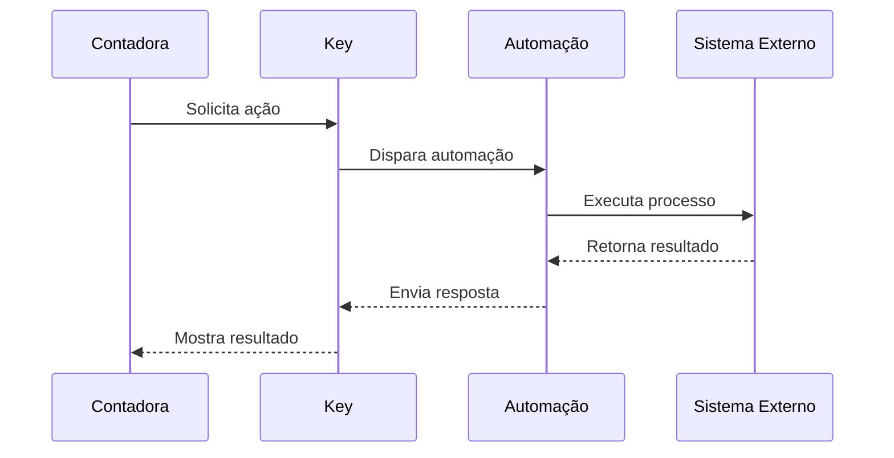
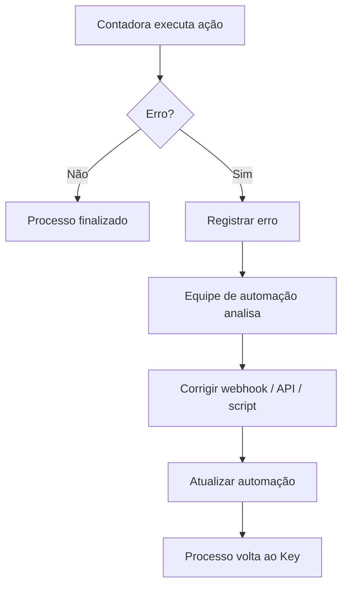

# 🔑 Key Contabeleza — Hub Operacional de Automações

> Documento estratégico que define a visão de transformar o **Key Contabeleza** no **centro operacional interno da Contabeleza**.

Este README descreve **como o sistema deve evoluir para se tornar a principal ferramenta de execução de processos contábeis**, permitindo que o time realize tarefas complexas com poucos cliques.

---

# 🎯 Visão

O objetivo é transformar o **Key Contabeleza** em um **Hub Operacional Interno**, onde:

* O atendimento continua **100% humano**
* As contadoras executam processos via interface simples
* O sistema executa automações por trás
* O time de automação corrige e evolui os fluxos

## Filosofia operacional

```
Humanos decidem
↓
Sistema executa
↓
Automação resolve
```

---

# 👥 Estrutura da Equipe

## Time de Automação

Responsáveis por:

* criar automações
* corrigir erros de integrações
* melhorar scripts
* manter workflows

```
Guilherme
Luan
Pedro
```

---

## Time Contábil Operacional

Responsáveis por:

* executar solicitações
* atender clientes
* usar o Key como ferramenta principal

```
Sheila
Hellen
(Atendimento MEI)
```

---

# 🧭 Modelo Operacional



---

# 🧩 Papel do Key Contabeleza

O Key deve funcionar como um **painel de comandos operacionais**.

## Interface ideal

```
🔎 Buscar profissional
CPF / CNPJ

Ações disponíveis

[ Emitir DAS ]
[ Emitir Nota ]
[ Parcelar Débitos ]
[ Criar Senha NFS-e ]
[ Entregar DASN ]
[ Gerar Contrato ]
```

Cada ação dispara uma automação.

---

# ⚙️ Arquitetura de Execução



---

# 🔄 Fluxo de Execução de Processo



---

# 🚨 Fluxo de Correção de Erros

Quando um processo falha:



---

# 🔧 Tipos de Problemas Esperados

Problemas comuns que o time de automação irá resolver:

```
Mudança em portal governamental
Falha de autenticação
Erro em API
Erro em webhook
Mudança em layout de site
Problemas de dados
```

---

# 📊 Evolução do Sistema

Fase 1

```
Centralizar processos no Key
```

Fase 2

```
Automatizar tarefas repetitivas
```

Fase 3

```
Reduzir dependência de acesso manual
```

Fase 4

```
Key vira painel operacional completo
```

---

# 🧠 Princípio de Engenharia

Sempre que um processo falhar:

❌ NÃO resolver manualmente

✅ Corrigir o sistema

## Regra principal

```
Erro operacional
↓
Investigar causa
↓
Corrigir automação
↓
Atualizar Key
```

---

# 📈 Resultado Esperado

Com esse modelo:

* o Key se torna ferramenta central
* processos ficam mais rápidos
* menos trabalho manual
* conhecimento técnico fica acumulado
* sistema evolui continuamente

---

# 🏗 Futuro do Key Contabeleza

Se esse modelo evoluir corretamente, o Key poderá se tornar:

```
ERP interno da Contabeleza

ou

Plataforma de automação contábil
```

---

# 🚀 Conclusão

O **Key Contabeleza** não é apenas uma ferramenta.

Ele deve evoluir para se tornar o **núcleo operacional da empresa**, conectando:

* atendimento
* contabilidade
* automações
* integrações

Esse modelo permite escalar operações mantendo:

* atendimento humano
* eficiência tecnológica
* melhoria contínua do sistema.
